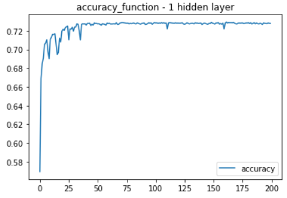

# Neural_Network_Charity_Analysis
Machine Learning Alphabet Soup Charity Analysis

## Overview
With the knowledge of machine learning and neural networks, create a binary classifier
that is capable of predicting whether applicants will be successful if funded by Alphabet Soup.
From Alphabet Soup’s business team, we received a CSV file containing more than 34,000 organizations that have received funding from Alphabet Soup over the years. Within this dataset are a number of columns that capture metadata about each organization.

## Objects
1. Compare the differences between the traditional machine learning classification and regression models and the neural network models.
2. Describe the perceptron model and its components. Implement neural network models using ensorFlow.
3. Explain how different neural network structures change algorithm performance.
4. Preprocess and construct datasets for neural network models.
5. Compare the differences between neural network models and deep neural networks.
6. Implement deep neural network models using TensorFlow.
7. Save trained TensorFlow models for later use.

## Software/Tools/Libraries
* Python 3.7.6, Jupyter Notebook 6.1.4 with OS, Pandas, sklearn, tensorflow 2.4
* Data Source: charity_data.csv

## Results

### Task 1. Preprocessing the Data for a Neural Network

**Objects: Using the knowledge of Pandas and the Scikit-Learn’s StandardScaler(), we’ll need to preprocess the dataset in order to compile, train, and evaluate the neural network model.**

* I established that the target variable is the "IS_SUCCESSFUL" column and the remaining columns became the features for the model. I removed the "EIN" and "NAME" columns as they did not offer any relevant data that could help the model perform better. We also replace it the value as ohters if the conouts of APPLICATION_TYPE and CLASSIFICATION are less than 1000. 

* After merging the one-hot encoding DataFrame with the original DataFrame, and drop the originals, the merged DataFrame should look like this:

### Task 2. Compile, Train, and Evaluate the Model

**Objects: Using the knowledge of TensorFlow, we’ll design a neural network, or deep learning model, to create a binary classification model that can predict if an Alphabet Soup–funded organization will be successful based on the features in the dataset.**

  

* We attempted two hidden_nodes_layer in the modle with 8 neuron network in the first layer and 5 in the second.Sequntial modle is used in this trainin, and the first and second layers used relu and the output layer had a sigmoid activation function. The relu does better with nonlinear data, and two layers allows for a second layer to reweight the inputs from the first layer. Here is the preformance metrics of this model.

* After modeling we have compiled, trained, and evaluated your binary classification model to calculate the model’s loss and accuracy. we also create a callback that saves the model's weights every 5 epochs. Here are the accuracy and loss histories of this model.

### Task 3. Optimization model Model

**Objects: Using your knowledge of TensorFlow, optimize your model in order to achieve a target predictive accuracy higher than 75%. If you can't achieve an accuracy higher than 75%, you'll need to make at least three attempts to do so.**

* First trial: We attempted two hidden_nodes_layer in the modle with 8 neuron network in the first layer and 5 in the second. 
We also replace it the value as ohters if the conouts of APPLICATION_TYPE and CLASSIFICATION are less than 1000.  We attempted two hidden_nodes_layer in the modle with 8 neuron network in the first layer and 5 in the second.Sequntial modle is used in this trainin, and the first and second layers used relu and the output layer had a sigmoid activation function. The relu does better with nonlinear data, and two layers allows for a second layer to reweight the inputs from the first layer. Here are the accuracy of this model.

*Second attempt: I removed the "SPECIAL_CONSIDERATIONS" column as I thought this might have been confusing the model. I also lowered the threshold for the classification column so that there were more unique values from that column. I also added a third layer with 6 neurons apart of it. By adding a third layer, I wanted to give the model another chance to reweight the inputs from the second layer to the third. Here are the preformance metrics of this model.

*Third attempt: I reverted back the threshold for the classification column. I also changed the activation function for the three layers to tanh. I did this to see if it would perform better than the relu function. Here are the preformance metrics of this model.

*Forth attempt: I removed the " STATUS" column as well as I thought it was confusing the model. I reverted back to two layers and the relu activation function. Lastly, I changed the neurons to 12 in the first layer and 8 in the second layer. This was to increase the parameters passed from the first layer to the second layer from 54 to 104. Here are the performance metrics of this model.

*Fifth attempt: I removed the " STATUS" column as well as I thought it was confusing the model. I reverted back to two layers and the relu activation function. Lastly, I changed the neurons to 12 in the first layer and 8 in the second layer. This was to increase the parameters passed from the first layer to the second layer from 54 to 104. Here are the performance metrics of this model.

## Summary

After five attempts, I was unable to create a model that could preform a 75% accuracy rating. This is potential becasue I got rid of too many columns, I did not use the correct activation function, or I did not have hte right amount of layers and neurons. These were the main areas I continued the change with little to no improvement. Next time, I would research more about activation functions to make sure that I am always choosing the right one based on the data. 