# Neural_Network_Charity_Analysis
Machine Learning Alphabet Soup Charity Analysis

## Overview
With the knowledge of machine learning and neural networks, create a binary classifier
that is capable of predicting whether applicants will be successful if funded by Alphabet Soup.
From Alphabet Soup’s business team, we received a CSV file containing more than 34,000 organizations that have received funding from Alphabet Soup over the years. Within this dataset are a number of columns that capture metadata about each organization.

## Objects
1. Compare the differences between the traditional machine learning classification and regression models and the neural network models.
2. Describe the perceptron model and its components. Implement neural network models using ensorFlow.
3. Explain how different neural network structures change algorithm performance.
4. Preprocess and construct datasets for neural network models.
5. Compare the differences between neural network models and deep neural networks.
6. Implement deep neural network models using TensorFlow.
7. Save trained TensorFlow models for later use.

## Software/Tools/Libraries
* Python 3.7.6, Jupyter Notebook 6.1.4 with OS, Pandas, sklearn, tensorflow 2.4
* Data Source: charity_data.csv

## Results

### Task 1. Preprocessing the Data for a Neural Network

**Objects: Using the knowledge of Pandas and the Scikit-Learn’s StandardScaler(), we’ll need to preprocess the dataset in order to compile, train, and evaluate the neural network model.**

* I established that the target variable is the "IS_SUCCESSFUL" column and the remaining columns became the features for the model. I removed the "EIN" and "NAME" columns as they did not offer any relevant data that could help the model perform better. We also replace it the value as ohters if the conouts of APPLICATION_TYPE and CLASSIFICATION are less than 1000. 

* After merging the one-hot encoding DataFrame with the original DataFrame, and drop the originals, the merged DataFrame should look like this:

**one-hot encoding DataFrame**

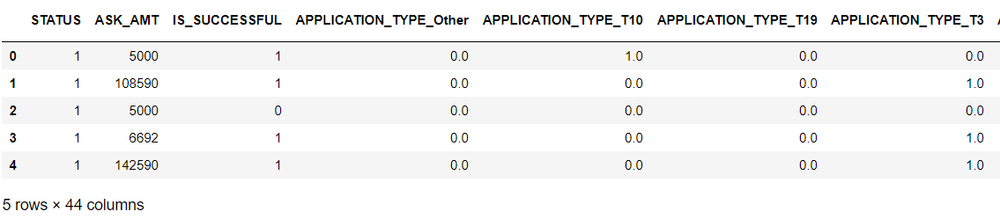

### Task 2. Compile, Train, and Evaluate the Model

**Objects: Using the knowledge of TensorFlow, we’ll design a neural network, or deep learning model, to create a binary classification model that can predict if an Alphabet Soup–funded organization will be successful based on the features in the dataset.**

  
* We attempted two hidden_nodes_layer with 8 neuron network in the first layer and 5 in the second.Sequntial modle is used in this trainin, and the first and second layers used relu activation fuction, and the output layer had a sigmoid activation function. The relu does better with nonlinear data, and two layers allows for a second layer to reweight the inputs from the first layer. Here is the preformance metrics of this model.

**NN Summary Table**

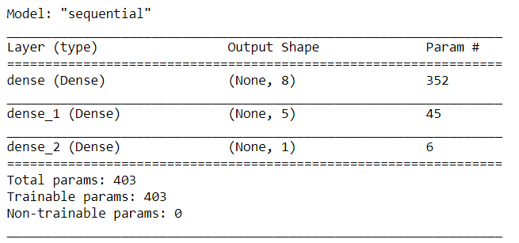

* After modeling we have compiled, trained, and evaluated your binary classification model to calculate the model’s loss and accuracy. we also create a callback that saves the model's weights every 5 epochs. Here are the accuracy and loss histories of this model.

**Accuracy_graph**

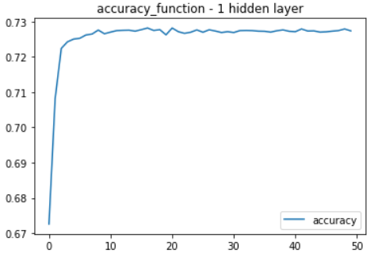

**Loss_graph**

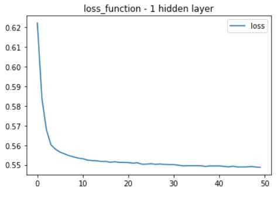

### Task 3. Optimization model Model

**Objects: Using your knowledge of TensorFlow, optimize your model in order to achieve a target predictive accuracy higher than 75%. If you can't achieve an accuracy higher than 75%, you'll need to make at least three attempts to do so.**

* First trial: We attempted two hidden_nodes_layer with 8 neuron network in the first layer and 5 in the second. I also bucket the  it the value as ohters if the conouts of APPLICATION_TYPE and CLASSIFICATION are less than 1000. The first, second, and output layers applied the linear activation fuction. Here are the accuracy value and its history figure of this model.

**First_accuracy_graph**

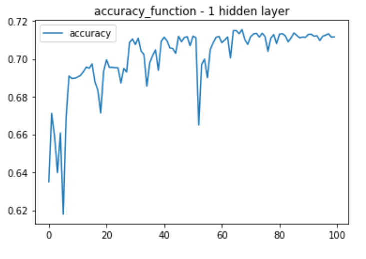

**First_loss_accuracy**

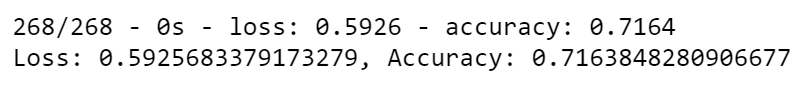

* Second attempt:  I added the number of first and second layers with with 12 neuron network in the first layer and 6 in the second. I also changed the the first, second, and output layers' activation fuction as relu, relu, and sigmoid fuctions. The accuracy is higher than the first trail but still less than 75%. Here are the accuracy value and its history figure of this model.

**Second_accuracy_graph**

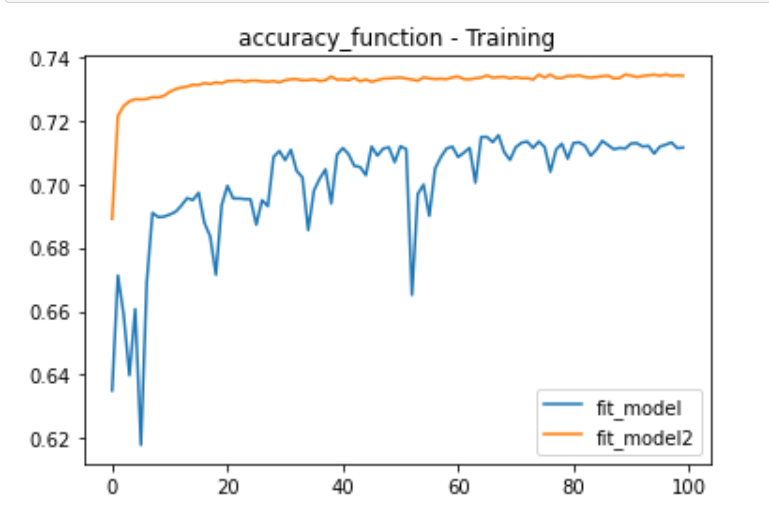

**Second_loss_accuracy**

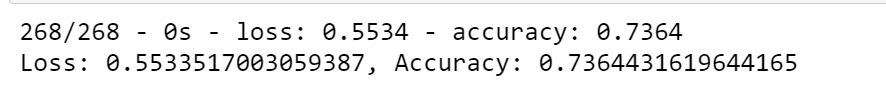

* Third attempt:  I added third layers with the activation functions: relu, and sigmoid fuctions. By adding a third layer, I wanted to give the model another chance to reweight the inputs from the second layer to the third. However, the accuracy is the same with the second trail and still less than 75%. Here are the accuracy value and its history figure of this model.

**Third_accuracy_graph**

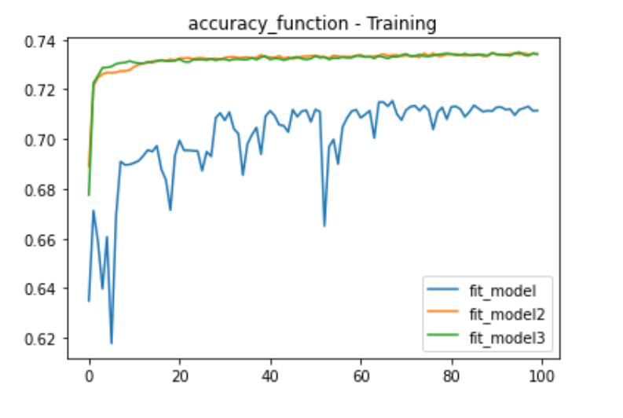

**Third_Trial_loss_accuracy**

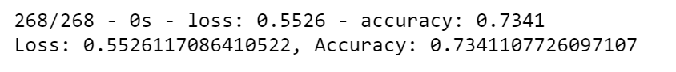

* Forth attempt: I also lowered the threshold for the classification and APPLICATION_TYPE columns so that there were more unique values from that column. I also divided the ask_amount colume to specfic values and merged it to the application_df. The accuracy slightly increased but still slimliar to the second, third tirals. Here are the accuracy value and its history figure of this model.

**Fourth_accuracy_graph**

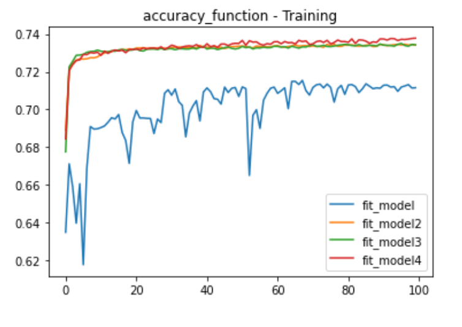

**Fourth_Trial_loss_accuracy**

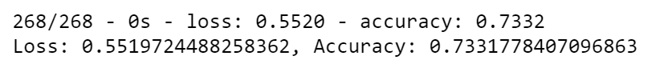

* Fifth attempt: Lastly, I removed the " STATUS" column because I thought it was confusing the model. I also remove the possible cartegories but the accuracy was still not changed much when comparing with the prior trials. Here are the accuracy value and its history figure of this model.

**Fifth_accuracy_graph**

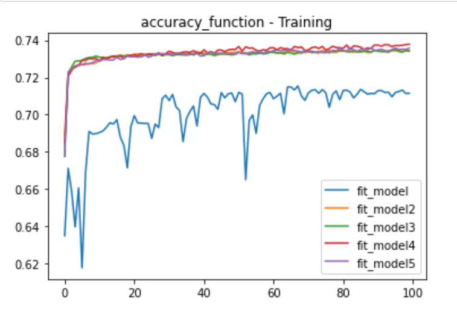

**FifthTrial_loss_accuracy**

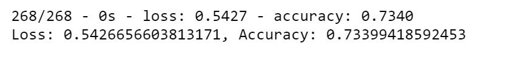

## Summary

After five attempts, I was unable to create a model that could preform a 75% accuracy rating. I added extra layers, applied the different activation fuctions, and clarified the additional valiables in the database, but it still lowere than the target accuracy values. This is potentially due to the noisy variables. Even we use correct layer size and activation fuction, the data itself most important to determine the accuracy of model. 
